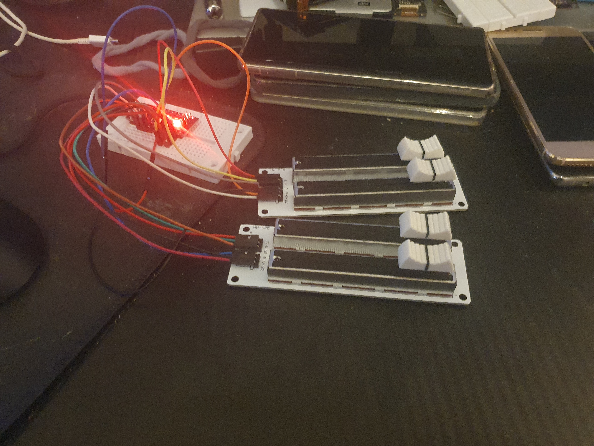

# AMFC | Arduino Midi Fader Controller

This is a project to make a simple fader bank to control stuff on your pc :D

<strong>Contents</strong>
<!-- TOC -->
- [Hardware](#hardware)
    - [Setup](#setup)
- [Software](#software)
- [Images](#images)
<!-- /TOC -->

## Overview

```
.
├── host_companion  | The host app that recieves data and turns it into MIDI.
└── arduino_sketch  | The Arduino sketch that sends the fader data!
```

## Hardware

For my particular setup I used:
 - 1x Arduino Nano clone
 - 2x double fader banks
 - a breadboard
 - Tons of wires

### Setup

Plug the faders `V` input into 5v, `G` input into Ground, and the `A{0,1}` inputs into `A0`, `A1`, `A2`, and `A3`.

## Software

Since the Arduino Nano doesn't have USB control, We can't make it act as a USB Midi device. So the Arduino sends the Faders' values of serial to the host companion program, which then creates a virtual midi device your DAW (or anything else) can read from.

On startup the Arduino wants to calibrate. Simply put all the sliders to the bottom position, send `READY`, put all the sliders in the top position, send `READY` again, and you're set!
If you for whatever reason wanna do this again, send `RESET` to the Arduino.

## Images

### My current setup

I do still need to mount the faders to something like a plank of wood, It slides around a lot now XD


